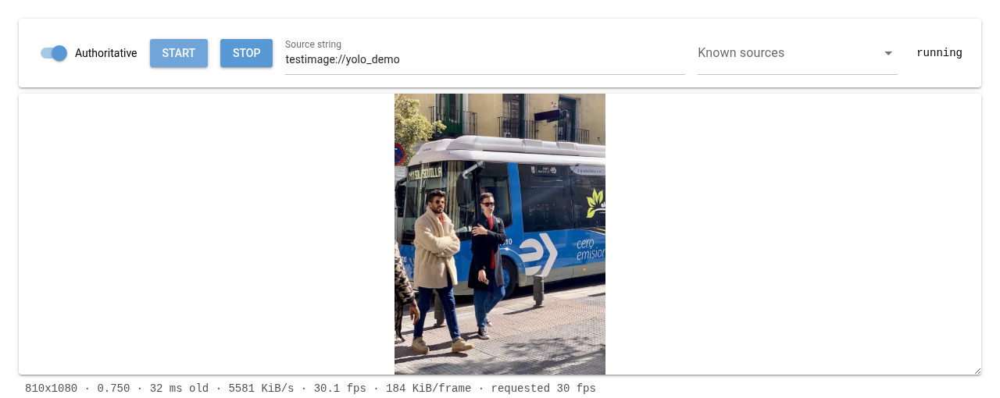
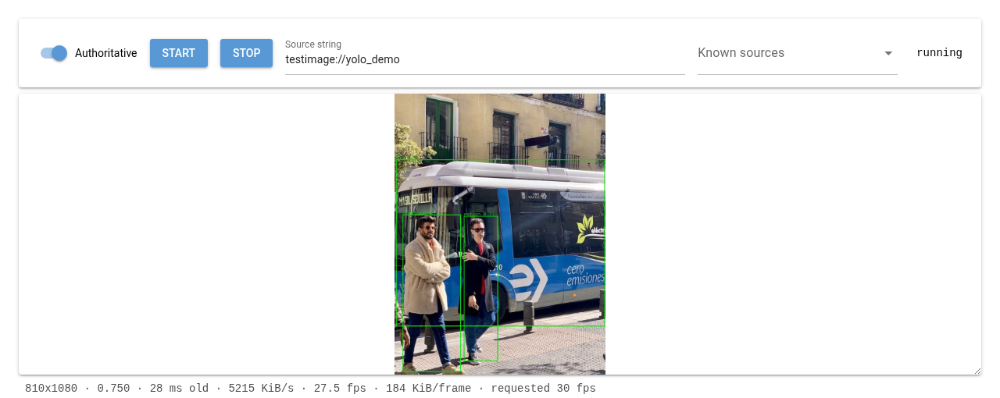

# Tutorial: YOLO detection boxes as a live overlay

This walks through [`examples/yolo_overlay.py`](../../examples/yolo_overlay.py),
a standalone script that:

1. Attaches to an *existing* camera over SpiriSynq (a mirror — it never
   opens a device itself).
2. Runs YOLO object detection on each new frame.
3. Publishes the detected boxes as their own SpiriSynq object.
4. Publishes a `HudWidget` that reads that object and draws the boxes as
   SVG rectangles, and attaches it to the camera so they show up
   composited on its picture.

It's a separate process from the camera and from any UI — run it next to
whatever is already serving the camera, point it at that camera's topic,
and stop it when you're done; nothing about the camera or the overlay
system needs to know it exists beforehand.

Install the one extra dependency this needs beyond SpiriCamera's own, via
the `examples` extra:

```console
uv sync --extra examples
```

(or `pip install ultralytics` directly, if you're not using `uv`)

Then run it against a camera another process already has open:

```console
python examples/yolo_overlay.py some-host/dev-video0
```

## Running it against the NiceGUI debug UI

The debug UI (`uv run python -m SpiriCamera.ui`) is just another process
that owns or mirrors a camera — the detector script attaches to *that*
camera's topic exactly like it would any other. The one piece of
information you need first is the topic, and the easiest way to get it
is to ask SpiriSynq the same question the UI's own "Cameras on the
network" panel does:

```console
python -c "
from SpiriSynq.session import current_session
for meta in current_session.get().list_topics(type_filter='Camera'):
    print(meta['topic'])
"
```

This prints every camera currently advertising itself, including the
UI's own — e.g. `$(hostname)/spiricamera_testimage` for the default
`testimage://` source (the topic's first segment is whatever machine
it's running on). (The "Synq Topic" field shown in the UI's Device card
is only the *local* half of this — `spiricamera_testimage` without the
hostname — so prefer the discovery one-liner over reading it off the
page.) If the UI is itself mirroring another camera rather than running
a device, this lists that camera's topic instead — either way, whatever
the UI is currently showing frames from is what gets discovered here.

Then run the detector against it:

```console
uv sync --extra examples   # once, if you haven't already
python examples/yolo_overlay.py $(hostname)/spiricamera_testimage
```

Refresh the UI's page (or hit the refresh icon on its overlay panel) and
the detection boxes should appear composited on the live picture within
a frame or two — no restart of the UI needed, since attaching the
overlay is done by editing `overlay_widgets`, a synced field the camera
picks up live.

Before the detector is running, the UI just shows the raw picture:



Once `yolo_overlay.py` is attached, green boxes appear around each
detection, composited directly into the frame the UI is already
displaying:



### Seeing an actual box

The default `testimage://` pattern is a color-bar test card — YOLO
correctly finds nothing in it, so `detections.boxes` will just stay
empty and no rectangles will appear. To see a real detection without
plugging in hardware, point the UI's "Source string" field (or
`SpiriCamera run testimage://yolo_demo` on the CLI) at
`testimage://yolo_demo` instead: a real photo (borrowed from
`ultralytics`'s own sample assets, so it's only available once the
`examples` extra is installed) panned slowly across frame, with people
and a bus for YOLO to actually find.

## How it fits together

### Getting frames without owning the device

```python
from SpiriCamera import Camera

cam = Camera.from_topic(args.topic)
```

This is the mirror pattern described in {doc}`../getting_started` — no
device is opened locally, `cam.image` is kept up to date in the
background, and there is no `read()` to drive. The script runs a tight
loop, not a poll: there's no sleep pacing it, it just runs detection
back-to-back as fast as `model.predict` allows, skipping a cycle only
when `cam.image` is the exact same object it already processed:

```python
last_jpeg = None
while True:
    jpeg = cam.image
    if not jpeg or jpeg is last_jpeg:
        continue
    last_jpeg = jpeg
    ...
```

In practice a real source produces frames faster than YOLO can keep up,
so that identity check almost never fires — it only matters at startup
(before a first frame has arrived) or against a very slow source. This
is deliberately *not* event-driven: an earlier version connected to
`cam.events.image` and ran detection from that callback, but
`cam.events.image` fires on zenoh's own callback thread, and psygnal
holds a lock for a signal's entire emission — for as long as a connected
slot is running. Detection taking a few hundred milliseconds meant
`cam.events.image.disconnect()`, called from the main thread during
shutdown, blocked on that same lock until inference finished, and the
non-daemon zenoh thread underneath it couldn't be joined until the
callback returned either — the process wouldn't die on `Ctrl-C`. The
plain loop above sidesteps all of that: there's no signal connection to
disconnect and no callback thread to wait on, so `Ctrl-C` stops it
immediately.

### A note on overlays feeding back into detection

Attaching the widget to the mirrored `cam` (`cam.overlay_widgets[...] =
{}`) bakes the boxes directly into `cam.image` server-side — see
{py:meth}`~SpiriCamera.camera.Camera.read`, which composites overlays
before encoding unless {py:attr}`~SpiriCamera.overlay.OverlayMixin.overlay_client_render`
is set. That means this same script's *next* detection pass runs on a
frame that already has its own boxes drawn on it: the overlay it just
added is fed straight back into the thing deciding what to add.
Harmless here — YOLO doesn't mistake a green rectangle for a person or
a bus, so it doesn't compound — but it's not the shape a real
deployment wants. There, the node that owns the camera and the node
that runs detection and publishes the overlay are two separate
processes, and the camera-owning one sets `overlay_client_render = True`
so overlays are only ever composited for display (in a browser, via
{py:meth}`~SpiriCamera.overlay.OverlayMixin.render_overlays_for_client`)
and never baked into the frames anything downstream analyzes.

### Publishing detections as a generic SpiriSynq object

The overlay system's data sources aren't camera-specific — *any*
`SyncableObject` with synced fields can be one (see
{py:mod}`SpiriCamera.overlay`'s module docstring for the mechanism, and
`docs/architecture.md` for why it's built this way). So the detector
defines the smallest object that fits:

```python
@dataclass
class Detections(SyncableObject):
    boxes: list = field(default_factory=list)


detections = Detections(synq_topic="yolo-detector/detections", synq_authoritive=True)
...
detections.boxes = boxes  # reassigning the field publishes it
```

Each entry in `boxes` is a plain dict — `{"x", "y", "w", "h", "label", "score"}`
in frame pixel coordinates. There's no dedicated "list of boxes" field
type in SpiriSynq; a plain `list` field works because assigning it wholesale
is just a normal synced-field change like any other.

### Authoring the overlay widget

A `HudWidget`'s SVG is a MiniJinja template. It declares the object it
needs with a comment (stripped before rendering) and reads its fields
through the alias that comment names:

```jinja
{# object: det = yolo-detector/detections #}
<svg ... viewBox="0 0 {{ frame.width }} {{ frame.height }}">
  
  <rect x="{{ box.x }}" y="{{ box.y }}" width="{{ box.w }}" height="{{ box.h }}"
        fill="none" stroke="lime" stroke-width="3"/>
  
</svg>
```

There's no built-in "bounding box" widget type — overlays are always
hand-authored SVG, so looping over `objects.det.boxes` and drawing
`<rect>` elements *is* the box-drawing widget, not a shortcut around one.

### Colouring boxes by class

The template above draws every box the same colour. Telling classes
apart at a glance -- people in one colour, vehicles in another -- needs
nothing from Python or SpiriSynq, only more of the MiniJinja already in
the template: a `` dict literal and a lookup inside the loop.
This is the step actually shipped in `examples/yolo_overlay.py`; it's
broken out here because it's a good worked example of MiniJinja doing
real logic, not just substitution:

```jinja
{# object: det = yolo-detector/detections #}

<svg ... viewBox="0 0 {{ frame.width }} {{ frame.height }}">
  
  
  <rect x="{{ box.x }}" y="{{ box.y }}" width="{{ box.w }}" height="{{ box.h }}"
        fill="none" stroke="{{ color }}" stroke-width="3"/>
  
</svg>
```

Two things worth noticing:

- `colors` is a plain template-local mapping, not a second declared
  object -- there's nothing about a class-to-colour scheme that's live
  or worth publishing over SpiriSynq, so it's just data baked into the
  template alongside the markup, exactly like a constant in any other
  language.
- `colors[box.label]` indexes that mapping with each box's own `label`
  field. Since {py:mod}`SpiriCamera.overlay` renders templates with
  MiniJinja's strict undefined behavior (see its module docstring), a
  `label` the map doesn't have an entry for would otherwise fail the
  whole widget's render for *every* box, not just the unrecognised one
  -- one dropped bounding box shouldn't blank out the rest. The
  `| default("yellow")` filter is what avoids that: it only replaces
  the specific lookup that came back undefined, falling back to a
  colour for any class the map doesn't name.

### Making the label readable on any background

A coloured label drawn straight onto the picture disappears the moment
it lands on a similarly-coloured or bright patch of frame -- a lime
label over grass, say. The usual SVG fix is an outline: give the
`<text>` a `stroke` and set `paint-order="stroke"` so it's drawn under
the fill. That doesn't work here -- thorvg's SVG parser silently
ignores `stroke`, `stroke-width`, and `paint-order` on `<text>`
altogether (the same family of parser gap {py:mod}`SpiriCamera.overlay`
already documents for `dy`, see its module docstring). `fill` on
`<text>` does work, though, which is enough to fake an outline by
drawing the label several times, nudged a pixel in each diagonal
direction in black, then once more on top in the real colour:

```jinja

...

<text x="{{ label_x + dx }}" y="{{ label_y + dy }}" fill="black" font-size="16">
  {{ box.label }} {{ box.score }}
</text>

<text x="{{ label_x }}" y="{{ label_y }}" fill="{{ color }}" font-size="16">
  {{ box.label }} {{ box.score }}
</text>
```

`halo_offsets` is a list of two-element lists, unpacked with
`` exactly like Python would. Deliberately
not a background chip behind the text (a filled or translucent `<rect>`,
the way {py:func}`~SpiriCamera.overlay.camera_metrics_widget` does it)
-- a halo keeps the label sitting directly on the picture with nothing
else added to it, at the cost of five text draws per box instead of one.
Either is a legitimate choice; which one reads better is a matter of
taste for a given overlay, not a limitation of one over the other.

The widget is published the same way the built-in
{py:func}`~SpiriCamera.overlay.tiger_widget` example is, just from an
external process instead of from inside `SpiriCamera`:

```python
widget = HudWidget(
    synq_topic="yolo-detector/boxes_overlay",
    synq_authoritive=True,
    anchor="top_left",
    svg_template=svg_template,
)
cam.overlay_widgets[widget.synq_absolute_path] = {}
```

That last line is what makes the mirrored `cam` actually render it —
`overlay_widgets` is a synced field itself, so this takes effect on the
camera's very next frame, wherever that camera's process is running, no
restart needed. Note the key is `widget.synq_absolute_path`, not the bare
`synq_topic` passed to the constructor — the widget's *base* topic
prefix (e.g. a session's default namespace) is folded in, and that's the
value the camera looks up by.

## How many lines is this, really

The whole script is about 60 lines of actual control flow (imports,
argument parsing, the detection loop, cleanup) plus a roughly 15-line SVG
template as a string constant — call it **~75 lines** for a from-scratch,
independently-runnable detector. None of it is boilerplate specific to
this tutorial: the same shape — mirror a camera, define a small
`SyncableObject`, author a template that reads it — is how any external
process publishes any kind of overlay data, not just bounding boxes.

## Cleaning up

The script publishes two objects (`detections` and `widget`) and closes
both, plus the mirrored `cam`, on `Ctrl-C`. Nothing it created outlives
the process — the camera stops rendering the overlay the moment the
`HudWidget` it was reading disappears from SpiriSynq.
